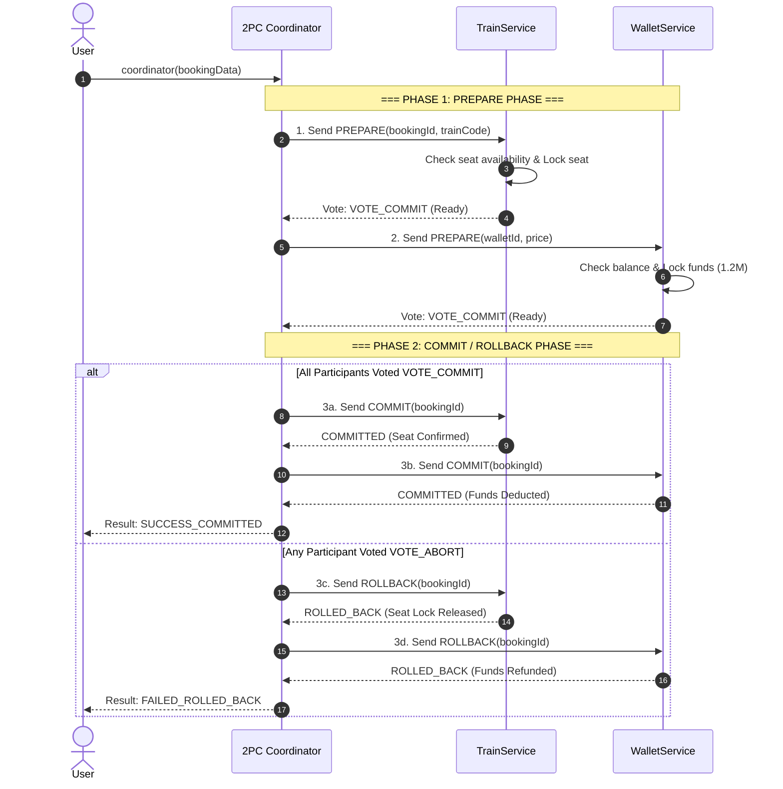

# BÁO CÁO PHÂN TÍCH VÀ MÔ PHỎNG - BÀI TẬP 1: GIAO THỨC TWO-PHASE COMMIT (2PC) CHO GIAO DỊCH ĐẶT VÉ

## 1. Mô Tả Quy Trình 2PC Trong Giao Dịch Đặt Vé Phân Tán

Giao thức **Two-Phase Commit (2PC)** là cơ chế đồng bộ giao dịch phân tán đảm bảo tính **Atomicity (Nguyên tố)** giữa nhiều Microservices độc lập: `TrainService` (Quản lý chỗ ngồi vé tàu) và `WalletService` (Quản lý ví điện tử của khách hàng), dưới sự điều phối của **Coordinator**.



---

## 2. Mã Giả Pseudocode Hoàn Chỉnh (`coordinator(bookingData)`)

```java
FUNCTION coordinator(bookingData):
    INPUT: 
        bookingId        = bookingData.bookingId
        trainCode        = bookingData.trainCode
        customerWalletId = bookingData.customerWalletId
        price            = bookingData.price

    PRINT "=== PHASE 1: PREPARE PHASE STARTED ==="
    
    // Khởi tạo danh sách tham gia và danh sách phiếu bầu
    participants = [TrainService, WalletService]
    votes        = []
    allReady     = TRUE

    // Phase 1: Gửi lệnh PREPARE đến tất cả các dịch vụ
    FOR EACH service IN participants DO:
        PRINT "[Coordinator] Sending PREPARE request to " + service.getName()
        
        response = service.prepare(bookingData)
        APPEND response TO votes
        
        PRINT "[Coordinator] Vote from " + service.getName() + ": " + response.vote + " (" + response.reason + ")"
        
        IF response.vote != VOTE_COMMIT THEN:
            allReady = FALSE
        END IF
    END FOR

    // Phase 2: Quyết định Commit hoặc Rollback toàn bộ
    PRINT "=== PHASE 2: DECISION PHASE ==="

    IF allReady == TRUE THEN:
        PRINT "[Coordinator] Decision: GLOBAL COMMIT (All services are READY)"
        
        FOR EACH service IN participants DO:
            PRINT "[Coordinator] Sending COMMIT request to " + service.getName()
            service.commit(bookingData)
        END FOR
        
        PRINT "=== TRANSACTION SUCCESSFUL: BOOKING COMMITTED ==="
        RETURN "SUCCESS_COMMITTED"
        
    ELSE:
        PRINT "[Coordinator] Decision: GLOBAL ROLLBACK (At least one service ABORTED)"
        
        // Gửi lệnh Rollback đến TẤT CẢ dịch vụ (kể cả dịch vụ đã báo Ready trước đó)
        FOR EACH service IN participants DO:
            PRINT "[Coordinator] Sending ROLLBACK request to " + service.getName()
            service.rollback(bookingData)
        END FOR
        
        PRINT "=== TRANSACTION FAILED: ALL SERVICES ROLLED BACK ==="
        RETURN "FAILED_ROLLED_BACK"
    END IF
END FUNCTION
```

---

## 3. Kết Quả Mô Phỏng Màn Hình Vời Dữ Liệu Đầu Vào

### 3.1 Kịch bản 1: Thành Công (Happy Path - Ví đủ tiền & Tàu còn chỗ)

**Dữ liệu đầu vào:**
```json
{
  "bookingId": "TRAIN-2024-089",
  "trainCode": "SE5",
  "customerWalletId": "W-456",
  "price": 1200000
}
```

**Log màn hình (Output):**
```text
================================================================================
[COORDINATOR] STARTING 2PC TRANSACTION FOR BOOKING ID: TRAIN-2024-089
[COORDINATOR] Input: BookingData{bookingId='TRAIN-2024-089', trainCode='SE5', customerWalletId='W-456', price=1200000.0}
================================================================================
>>> PHASE 1: PREPARE PHASE - Broadcasting PREPARE request to all participants
[COORDINATOR] Sending PREPARE to [TrainService]...
[TrainService] Received PREPARE request for Booking ID: TRAIN-2024-089, Train Code: SE5
[TrainService] PREPARE SUCCESS: Seat locked for Booking ID TRAIN-2024-089
[COORDINATOR] Received vote from [TrainService]: VOTE_COMMIT (Reason: Seat available and locked)
[COORDINATOR] Sending PREPARE to [WalletService]...
[WalletService] Received PREPARE request for Wallet ID: W-456, Amount: 1200000.0 VND
[WalletService] PREPARE SUCCESS: Locked 1200000.0 VND for Wallet ID W-456. Remaining balance: 800000.0 VND
[COORDINATOR] Received vote from [WalletService]: VOTE_COMMIT (Reason: Sufficient balance, funds locked)
--------------------------------------------------------------------------------
>>> PHASE 2: GLOBAL COMMIT - All participants voted READY (VOTE_COMMIT)
[COORDINATOR] Decision: COMMIT. Broadcasting COMMIT to all participants...
--------------------------------------------------------------------------------
[COORDINATOR] Sending COMMIT to [TrainService]...
[TrainService] Received COMMIT request for Booking ID TRAIN-2024-089
[TrainService] COMMIT SUCCESS: Ticket confirmed for Booking ID TRAIN-2024-089. Remaining seats for SE5: 9
[COORDINATOR] Sending COMMIT to [WalletService]...
[WalletService] Received COMMIT request for Booking ID TRAIN-2024-089
[WalletService] COMMIT SUCCESS: Permanently deducted 1200000.0 VND for Booking ID TRAIN-2024-089
================================================================================
[COORDINATOR] TRANSACTION SUCCESSFUL - Booking TRAIN-2024-089 COMMITTED
================================================================================
```

---

### 3.2 Kịch bản 2: Thất Bại Do Ví Không Đủ Tiền (Wallet Abort $\rightarrow$ Global Rollback)

**Dữ liệu đầu vào:**
```json
{
  "bookingId": "TRAIN-2024-090",
  "trainCode": "SE5",
  "customerWalletId": "W-100",
  "price": 1200000
}
```

**Log màn hình (Output):**
```text
================================================================================
[COORDINATOR] STARTING 2PC TRANSACTION FOR BOOKING ID: TRAIN-2024-090
================================================================================
>>> PHASE 1: PREPARE PHASE - Broadcasting PREPARE request to all participants
[COORDINATOR] Sending PREPARE to [TrainService]...
[TrainService] PREPARE SUCCESS: Seat locked for Booking ID TRAIN-2024-090
[COORDINATOR] Received vote from [TrainService]: VOTE_COMMIT (Reason: Seat available and locked)
[COORDINATOR] Sending PREPARE to [WalletService]...
[WalletService] PREPARE FAIL: Wallet W-100 balance (500000.0 VND) is insufficient for required 1200000.0 VND!
[COORDINATOR] Received vote from [WalletService]: VOTE_ABORT (Reason: Insufficient balance)
--------------------------------------------------------------------------------
>>> PHASE 2: GLOBAL ROLLBACK - At least one participant voted ABORT (VOTE_ABORT)
[COORDINATOR] Decision: ROLLBACK. Broadcasting ROLLBACK to ALL participants...
--------------------------------------------------------------------------------
[COORDINATOR] Sending ROLLBACK to [TrainService]...
[TrainService] Received ROLLBACK request for Booking ID TRAIN-2024-090
[TrainService] ROLLBACK SUCCESS: Seat lock released for Booking ID TRAIN-2024-090
[COORDINATOR] Sending ROLLBACK to [WalletService]...
[WalletService] Received ROLLBACK request for Booking ID TRAIN-2024-090
[WalletService] ROLLBACK NO-OP: Booking ID TRAIN-2024-090 was not locked.
================================================================================
[COORDINATOR] TRANSACTION FAILED - Booking TRAIN-2024-090 ROLLED BACK
================================================================================
```

---

## 4. Giải Thích Cách Chương Trình Quyết Định Commit Hoặc Rollback

* **Nguyên tắc "Đồng thuận tuyệt đối" (All-or-Nothing Consensus):**
  * Trong Phase 1, Coordinator chỉ đưa ra quyết định **GLOBAL_COMMIT** khi và chỉ khi **tất cả** các dịch vụ thành phần tham gia đều trả về phiếu bầu `VOTE_COMMIT` (nghĩa là đã khóa thành công tài nguyên và sẵn sàng commit).
  * Nếu có **dù chỉ 1 dịch vụ** trả về `VOTE_ABORT` (do ví không đủ tiền hoặc hết vé tàu), Coordinator lập tức đưa ra quyết định **GLOBAL_ROLLBACK**.
* **Đảm bảo tính nhất quán (Consistency):** Lệnh `ROLLBACK` được phát cho **tất cả** các dịch vụ (bao gồm cả `TrainService` đã khóa vé thành công ở Phase 1) để giải phóng hoàn toàn các tài nguyên đã bị khóa, ngăn chặn tình trạng "giữ vé nhưng không trừ được tiền" hoặc ngược lại.
