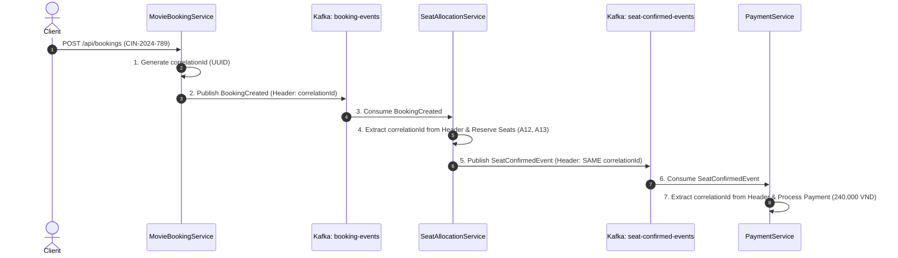

# BÁO CÁO PHÂN TÍCH VÀ THIẾT KẾ - BÀI TẬP 2: XÂY DỰNG "BẢN ĐỒ DẪN ĐƯỜNG" VỚI CORRELATION ID & TRACING

---

## 1. Mô Tả Luồng Sự Kiện & Vai Trò Của Correlation ID

Trong kiến trúc Microservices giao tiếp bất đồng bộ qua Message Broker (Kafka), giao dịch đặt vé xem phim trực tuyến diễn ra qua 3 dịch vụ chính theo mô hình **Choreography Saga**:



### Vai trò của Correlation ID:
* **Định danh xuyên suốt (End-to-End Tracing):** Khi một giao dịch phân tán đi qua nhiều Microservices, `Correlation ID` đóng vai trò là "mã căn cước" đại diện duy nhất cho giao dịch đó.
* **Ngăn ngừa thảm họa "Event Spaghetti":** Giúp các kỹ sư và công cụ giám sát (Jaeger / Zipkin / ELK Stack) gom nhóm toàn bộ log từ hàng nghìn log lines của nhiều máy chủ khác nhau về đúng một hành trình duy nhất của vé `CIN-2024-789`.

---

## 2. Kỹ Thuật Gắn Correlation ID Vào Kafka Header & Lợi Ích Kiến Trúc

### 2.1 Phương pháp triển khai
Hệ thống sử dụng cơ chế **Kafka Record Headers** được giới thiệu từ Kafka 0.11:

* **Tại Producer (`MovieBookingService` & `SeatAllocationService`):**
  ```java
  ProducerRecord<String, String> record = new ProducerRecord<>("booking-events", request.getCinemaBookingId(), payload);
  // Gắn correlationId vào HEADER - KHÔNG đặt trong payload
  record.headers().add("correlationId", correlationId.getBytes(StandardCharsets.UTF_8));
  kafkaTemplate.send(record);
  ```

* **Tại Consumer (`SeatAllocationService` & `PaymentService`):**
  ```java
  @KafkaListener(topics = "booking-events", groupId = "seat-group")
  public void handleBooking(ConsumerRecord<String, String> record) {
      // Trích xuất correlationId từ HEADER - KHÔNG lấy từ payload
      String correlationId = new String(record.headers().lastHeader("correlationId").value(), StandardCharsets.UTF_8);
      log.info("[SeatAllocationService] Received SeatRequest for {}. CorrelationID: {}", record.key(), correlationId);
  }
  ```

### 2.2 Lợi ích của việc đưa Correlation ID vào Header thay vì Payload
1. **Phân tách mối quan tâm (Separation of Concerns):** Payload giữ nguyên schema DTO nghiệp vụ thuần túy (`CinemaBookingRequest`), không bị lẫn các thông tin thuộc về tầng hạ tầng tracing/telemetry.
2. **Tính Trong Suốt (Transparency & Interceptor Compatibility):** Các công cụ Distributed Tracing (như OpenTelemetry, Spring Cloud Sleuth/Micrometer Tracing) hoặc API Gateway có thể tự động inject/extract `Correlation ID` ở tầng Interceptor mà không cần giải mã (Deserialize) JSON payload.
3. **Tối ưu hóa Hiệu năng (High Throughput & Low Overhead):** Các bộ lọc (Filter), Router hoặc Event Consumer có thể kiểm tra Header để đưa ra quyết định mà không tốn chi phí CPU để parse/deserialize toàn bộ payload JSON.

---

## 3. Hướng Dẫn Cài Đặt & Chạy Dự Án

### 3.1 Yêu cầu môi trường
* Java 17+, Gradle 8+.
* Apache Kafka & Zookeeper (Chạy local hoặc qua Docker).

### 3.2 Khởi động Kafka & Tạo Topics
Nếu sử dụng Docker:
```bash
docker-compose up -d zookeeper kafka
```

Tạo các topics cần thiết:
```bash
kafka-topics.sh --create --topic booking-events --bootstrap-server localhost:9092 --partitions 1 --replication-factor 1
kafka-topics.sh --create --topic seat-confirmed-events --bootstrap-server localhost:9092 --partitions 1 --replication-factor 1
```

### 3.3 Chạy và Kiểm thử ứng dụng
1. **Khởi động ứng dụng Spring Boot:**
   ```bash
   cd SS15/BaiTap2
   ./gradlew bootRun
   ```

2. **Gửi Request đặt vé xem phim từ Client:**
   ```bash
   curl -X POST http://localhost:8080/api/bookings \
     -H "Content-Type: application/json" \
     -d '{
       "cinemaBookingId": "CIN-2024-789",
       "movieCode": "AVENGERS-5",
       "showTime": "2024-12-25T19:30:00",
       "seatNumbers": ["A12", "A13"],
       "customerEmail": "tuananh@email.com",
       "totalPrice": 240000
     }'
   ```

3. **Chạy Unit/Integration Tests:**
   ```bash
   ./gradlew test
   ```

---

## 4. Kết Quả Kiểm Thử (Expected Log Output)

Khi chạy toàn bộ luồng với dữ liệu đầu vào `CIN-2024-789`, log hệ thống hiển thị chính xác chuỗi `CorrelationID` đồng nhất xuyên suốt qua 3 dịch vụ:

```text
[MovieBookingService] Created booking CIN-2024-789. CorrelationID: 550e8400-e29b-41d4-a716-446655440000
[SeatAllocationService] Received SeatRequest for CIN-2024-789. CorrelationID: 550e8400-e29b-41d4-a716-446655440000
[SeatAllocationService] Seat reserved: A12, A13. CorrelationID: 550e8400-e29b-41d4-a716-446655440000
[PaymentService] Processing Payment for CIN-2024-789. CorrelationID: 550e8400-e29b-41d4-a716-446655440000
[PaymentService] Payment success: 240000 VND. CorrelationID: 550e8400-e29b-41d4-a716-446655440000
```

> **Lưu ý:** Tất cả các log lines trên đều chia sẻ cùng một `CorrelationID` duy nhất (`550e8400-e29b-41d4-a716-446655440000`), giúp truy vết toàn bộ quá trình đặt vé hoàn hảo.
