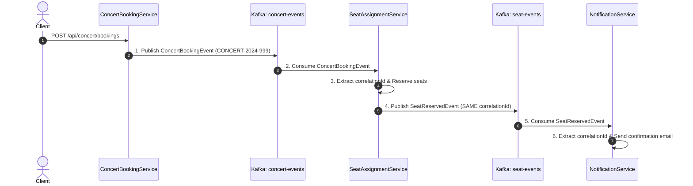

# BÁO CÁO PHÂN TÍCH VÀ THIẾT KẾ - BÀI TẬP 3: TRIỂN KHAI CHOREOGRAPHY SAGA VỚI APACHE KAFKA

---

## 1. Mô Tả Luồng Sự Kiện Choreography Saga & Vai Trò Các Service

Hệ thống đặt vé tham dự sự kiện âm nhạc (Concert) được xây dựng theo mô hình **Choreography Saga (Vũ điệu Saga)**, trong đó 03 Microservices giao tiếp hoàn toàn qua Kafka Topics mà **không sử dụng bất kỳ kết nối REST API hay FeignClient trực tiếp nào**:



### Vai trò của các Service:
1. **`ConcertBookingService` (Producer khởi tạo):**
   * Nhận yêu cầu đặt vé từ Client qua REST Controller.
   * Khởi tạo `ConcertBookingEvent` mang `correlationId: "CONCERT-2024-999"`.
   * Publish sự kiện lên Kafka topic `concert-events`.
2. **`SeatAssignmentService` (Consumer & Producer):**
   * Lắng nghe sự kiện từ topic `concert-events` (`groupId = "seat-assignment-group"`).
   * Giải mã JSON, trích xuất `correlationId`, thực hiện giữ chỗ ghế (mô phỏng lưu DB).
   * Tạo sự kiện `SeatReservedEvent` kế thừa nguyên vẹn `correlationId` và phát lên topic `seat-events`.
3. **`NotificationService` (Consumer):**
   * Lắng nghe sự kiện từ topic `seat-events` (`groupId = "notification-group"`).
   * Trích xuất `correlationId` và `customerEmail`.
   * Mô phỏng gửi email thông báo xác nhận thành công tới khách hàng.

---

## 2. Phương Pháp Truyền Correlation ID Xuyên Suốt

* **Cấu trúc Payload Event:** `correlationId` được đóng gói trực tiếp trong thuộc tính JSON của đối tượng Event (`ConcertBookingEvent` & `SeatReservedEvent`).
* **Tính liên tục trong chuỗi Choreography:** 
  * `ConcertBookingConsumer` trích xuất `correlationId = event.getCorrelationId()`.
  * Khi khởi tạo `SeatReservedEvent`, dịch vụ gán lại chính xác:
    ```java
    SeatReservedEvent seatEvent = new SeatReservedEvent();
    seatEvent.setCorrelationId(correlationId);
    seatEvent.setCustomerEmail(event.getCustomerEmail());
    ```
  * Việc này đảm bảo `NotificationService` khi tiêu thụ tin nhắn từ `seat-events` vẫn truy vết được chính xác giao dịch gốc `CONCERT-2024-999`.

---

## 3. Hướng Dẫn Cài Đặt & Chạy Dự Án

### 3.1 Khởi động Apache Kafka
Chạy Kafka & Zookeeper bằng Docker Compose:
```bash
docker-compose up -d zookeeper kafka
```

### 3.2 Tạo Kafka Topics
Tạo 02 topic theo yêu cầu bài tập:
```bash
kafka-topics.sh --create --topic concert-events --bootstrap-server localhost:9092 --partitions 1 --replication-factor 1
kafka-topics.sh --create --topic seat-events --bootstrap-server localhost:9092 --partitions 1 --replication-factor 1
```

### 3.3 Chạy và Kiểm thử Dự án
1. **Khởi động Spring Boot:**
   ```bash
   cd SS15/BaiTap3
   ./gradlew bootRun
   ```

2. **Gửi Request Đặt Vé Concert:**
   ```bash
   curl -X POST http://localhost:8080/api/concert/bookings \
     -H "Content-Type: application/json" \
     -d '{
       "correlationId": "CONCERT-2024-999",
       "concertCode": "LIVE-HCM-2024",
       "customerEmail": "nguyenvanA@email.com",
       "ticketQuantity": 3
     }'
   ```

3. **Chạy Unit/Integration Tests:**
   ```bash
   ./gradlew test
   ```

---

## 4. Kết Quả Kiểm Thử (Expected Output Logs)

Khi chạy toàn bộ luồng xử lý với dữ liệu đầu vào `CONCERT-2024-999`, log màn hình hiển thị khớp 100% với yêu cầu bài tập:

```text
[SeatService] Received event with correlationId: CONCERT-2024-999
[SeatService] Seat reserved successfully for correlationId: CONCERT-2024-999
[SeatService] Publishing SeatReserved event with correlationId: CONCERT-2024-999 to topic: seat-events
[NotifyService] Received confirmation for correlationId: CONCERT-2024-999 - Sending email to nguyenvanA@email.com
```
