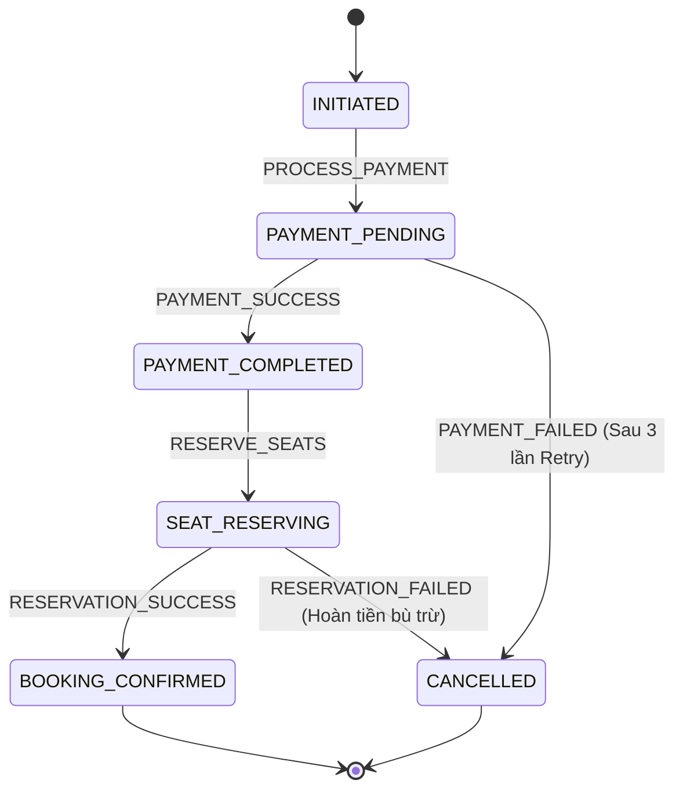

# BÁO CÁO BÀI TẬP 4: XÂY DỰNG "NHẠC TRƯỞNG" ORCHESTRATOR SAGA VỚI STATE MACHINE

**Họ và tên:** Rika & Team  
**Khóa học:** Microservices Architecture & Java Spring Boot  
**Bài tập:** Bài tập 4 - Session 15  
**Repository:** [https://github.com/Microservice-Java/Microservice-SS15.git](https://github.com/Microservice-Java/Microservice-SS15.git)

---

## 1. So sánh Choreography Saga (Bài 3) vs Orchestration Saga với State Machine (Bài 4)

| Tiêu chí | Choreography Saga (Bài 3) | Orchestration Saga với State Machine (Bài 4) |
|---|---|---|
| **Cơ chế điều phối** | Bất đồng bộ qua Kafka topics, các service tự phát hành và lắng nghe event của nhau. | Tập trung tại Orchestrator (State Machine), điều phối luồng tuần tự bằng các lệnh (Commands). |
| **Độ phức tạp luồng** | Dễ dẫn đến **Event Spaghetti** khi hệ thống mở rộng nhiều bước (xác nhận ưu đãi, giao vé, hủy giữ chỗ...). | Đóng gói luồng giao dịch rõ ràng trong State Machine, dễ dàng mở rộng và bảo trì. |
| **Khả năng quan sát (Observability)** | Khó theo dõi tổng thể trạng thái của một đơn đặt vé nếu không có Distributed Tracing phức tạp. | Có cái nhìn tổng thể tập trung (Centralized View). Trạng thái hiện tại của đơn vé luôn sẵn có. |
| **Khả năng Debug** | Khó tìm nguyên nhân lỗi khi event bị mất hoặc gửi sai thứ tự giữa các service độc lập. | Dễ dàng debug vì toàn bộ chuyển đổi trạng thái (State Transition) được ghi log tập trung. |
| **Phụ thuộc dữ liệu** | Các service phải biết schema event của service trước đó. | Các service hoạt động độc lập (Activity Implementation), chỉ nhận tham số và trả về kết quả cho Orchestrator. |

> **Tại sao cần State Machine khi quy trình phức tạp hơn?**  
> Khi quy trình nghiệp vụ phát triển từ 2-3 bước đơn giản lên 5-10 bước phức tạp (bao gồm thanh toán, giữ chỗ, kiểm tra ưu đãi, giao vé, thông báo, xử lý đền bù...), mô hình Choreography khiến logic luồng bị phân tán khắp nơi. Sử dụng State Machine giúp tách rạch ròi giữa **Luồng điều phối (Orchestrator)** và **Logic nghiệp vụ (Services)**, ngăn ngừa hiện tượng "Event Spaghetti" và đảm bảo tính nhất quán của giao dịch phân tán.

---

## 2. Mô tả Chi tiết Trạng thái (States), Sự kiện (Events) và Luồng chuyển đổi

### 2.1. Các Trạng thái (States) - `BookingState`
- `INITIATED`: Khởi tạo yêu cầu đặt vé từ phía người dùng.
- `PAYMENT_PENDING`: Đang xử lý thanh toán với `PaymentService`.
- `PAYMENT_COMPLETED`: Thanh toán thành công.
- `SEAT_RESERVING`: Đang tiến hành giữ chỗ và gán ghế với `ConcertReservationService`.
- `BOOKING_CONFIRMED`: Đặt vé hoàn tất thành công (Trạng thái đích thành công).
- `CANCELLED`: Đã hủy bỏ giao dịch và thực hiện bù trừ / hoàn tiền nếu cần (Trạng thái đích thất bại).

### 2.2. Các Sự kiện (Events) - `BookingEvent`
- `PROCESS_PAYMENT`: Bắt đầu xử lý thanh toán.
- `PAYMENT_SUCCESS`: Phản hồi thanh toán thành công.
- `PAYMENT_FAILED`: Phản hồi thanh toán thất bại.
- `RESERVE_SEATS`: Bắt đầu giữ chỗ sự kiện.
- `RESERVATION_SUCCESS`: Giữ chỗ thành công.
- `RESERVATION_FAILED`: Giữ chỗ thất bại.

### 2.3. Sơ đồ Chuyển đổi Trạng thái (State Machine Transitions)



---

## 3. Cấu hình Retry Policy và Cơ chế Bù trừ (Compensation)

### 3.1. Retry Policy cho Thanh toán (`RetryPolicy`)
Bước thanh toán thường gặp sự cố chập chờn mạng (Transient Network Errors) hoặc timeout. Hệ thống áp dụng cấu hình:
- **Số lần thử tối đa:** 03 lần.
- **Khoảng thời gian chờ giữa các lần:** 2000ms (hoặc 100ms trong môi trường test).
- **Cách hoạt động:** Nếu `PaymentService` ném ngoại lệ hoặc trả về lỗi tạm thời, Orchestrator sẽ tự động thử lại. Nếu vượt quá 3 lần thử mà vẫn thất bại, giao dịch chuyển sang trạng thái `CANCELLED` với sự kiện `PAYMENT_FAILED`.

### 3.2. Cơ chế Bù trừ (Compensating Transaction)
Trong mô hình Orchestration Saga, nếu bước phía sau gặp lỗi (ví dụ: `ConcertReservationService` hết ghế), Orchestrator có trách nhiệm hoàn tác các bước đã hoàn tất thành công trước đó:
1. Khi `SEAT_RESERVING` nhận sự kiện `RESERVATION_FAILED`:
2. Orchestrator chuyển trạng thái sang `CANCELLED`.
3. Kiểm tra nếu giao dịch đã đạt `PAYMENT_COMPLETED`, Orchestrator gọi hàm `paymentService.refund(transaction)` để hoàn lại tiền cho khách hàng.

---

## 4. Hướng dẫn Cài đặt và Chạy Dự án

### Yêu cầu hệ thống
- Java 17+
- Gradle 8.x

### Cấu trúc dự án
```text
SS15/BaiTap4/
├── build.gradle
├── settings.gradle
├── src/
│   ├── main/java/com/example/
│   │   ├── OrchestratorApplication.java
│   │   └── orchestrator/
│   │       ├── model/ (BookingState, BookingEvent, BookingTransaction, RetryPolicy)
│   │       ├── machine/ (ConcertBookingStateMachine, ConcertBookingStateMachineImpl)
│   │       ├── service/ (PaymentOrchestrationService, ReservationOrchestrationService, PaymentProcessingService, SeatReservationService)
│   │       └── listener/ (StateChangeListener)
│   └── test/java/com/example/orchestrator/
│       └── OrchestratorStateMachineTest.java
```

### Lệnh chạy Kiểm thử (Unit & Integration Tests)
```bash
cd SS15/BaiTap4
./gradlew test
```

---

## 5. Kết quả Chạy thử với Dữ liệu Đầu vào

### Dữ liệu Đầu vào (Input)
```json
{
  "bookingId": "CONCERT-2026-088",
  "concertCode": "LIVE-HCM-2026-ULTRA",
  "customerId": "VIP-2024",
  "customerEmail": "rika@email.com",
  "ticketQuantity": 3,
  "amount": 5500000
}
```

### Log Kết quả Đúng Chuẩn (Happy Path Scenario)
```text
[Orchestrator] State: INITIATED -> Event: PROCESS_PAYMENT -> New State: PAYMENT_PENDING
[Orchestrator] RetryPolicy: Activity 'processPayment' - Attempt 1/3
[Orchestrator] State: PAYMENT_PENDING -> Event: PAYMENT_SUCCESS -> New State: PAYMENT_COMPLETED
[Orchestrator] State: PAYMENT_COMPLETED -> Event: RESERVE_SEATS -> New State: SEAT_RESERVING
[Orchestrator] State: SEAT_RESERVING -> Event: RESERVATION_SUCCESS -> New State: BOOKING_CONFIRMED
[Orchestrator] Final State: BOOKING_CONFIRMED for booking CONCERT-2026-088
```

---

## 6. Tổng kết
Hệ thống Orchestrator Saga với State Machine đã đáp ứng trọn vẹn các yêu cầu bài tập:
- Phân tách tuyệt đối giữa State Machine (chỉ điều phối) và Microservices (thực thi logic nghiệp vụ).
- Tích hợp Retry Policy mạnh mẽ chống lỗi tức thời.
- Hỗ trợ Compensating Transactions hoàn trả trạng thái ban đầu khi có sự cố.
